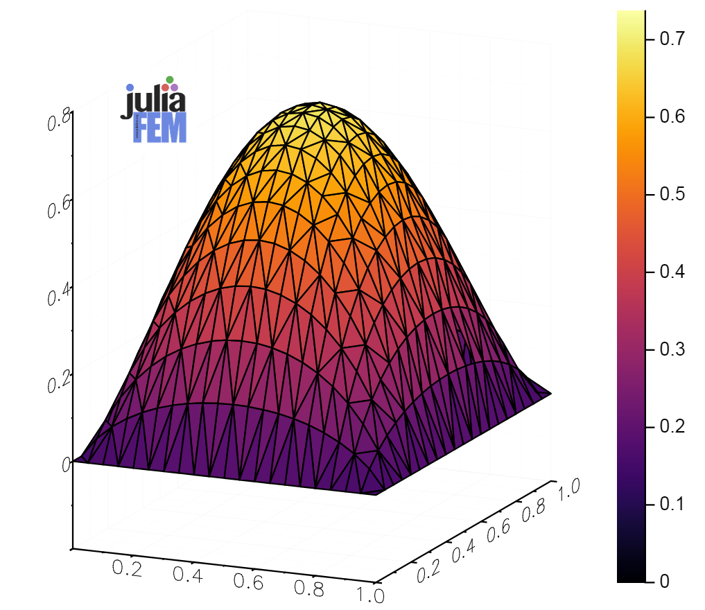

# PDEAssembler.jl

[![][travis-img]][travis-url]
[![][pkg-0.6-img]][pkg-0.6-url]
[![][pkg-0.7-img]][pkg-0.7-url]
[![][coveralls-img]][coveralls-url]
[![][docs-stable-img]][docs-stable-url]
[![][docs-latest-img]][docs-latest-url]
[![][issues-img]][issues-url]

Package assembles a set of discriteized partial differential equations and forms
global matrices M, C, K, and right hand side vector f.

```julia
using PDEAssembler
using PDEAssembler: get_unit_square, Poisson

field_elements, boundary_elements = get_unit_square()

field_problem = Problem(Poisson, "Poisson problem in 1x1 square", 1)
update!(field_elements, "source", 10.0)
update!(field_elements, "density", 6.0)
add_elements!(field_problem, field_elements)

boundary_problem = Problem(Poisson, "Poisson boundary", 1)
update!(boundary_elements, "fixed u", 0.0)
update!(boundary_elements, "density", 0.0)
add_elements!(boundary_problem, boundary_elements)

problems = (field_problem, boundary_problem)
M, C, K, f = get_global_matrices(problems, 0.0)
u = cholfact(Symmetric(K)) \ full(f)
X = first(problems)("geometry", 0.0)

N = length(u)
x = [X[i][1] for i=1:N]
y = [X[i][2] for i=1:N]

using Plots
surface(x, y, u)
```



[contrib-url]: https://juliafem.github.io/PDEAssembler.jl/latest/man/contributing/
[discourse-tag-url]: https://discourse.julialang.org/tags/boundingsphere
[gitter-url]: https://gitter.im/JuliaFEM/JuliaFEM.jl

[docs-latest-img]: https://img.shields.io/badge/docs-latest-blue.svg
[docs-latest-url]: https://juliafem.github.io/PDEAssembler.jl/latest

[docs-stable-img]: https://img.shields.io/badge/docs-stable-blue.svg
[docs-stable-url]: https://juliafem.github.io/PDEAssembler.jl/stable

[travis-img]: https://travis-ci.org/JuliaFEM/PDEAssembler.jl.svg?branch=master
[travis-url]: https://travis-ci.org/JuliaFEM/PDEAssembler.jl

[coveralls-img]: https://coveralls.io/repos/github/JuliaFEM/PDEAssembler.jl/badge.svg?branch=master
[coveralls-url]: https://coveralls.io/github/JuliaFEM/PDEAssembler.jl?branch=master

[issues-img]: https://img.shields.io/github/issues/JuliaFEM/PDEAssembler.jl.svg
[issues-url]: https://github.com/JuliaFEM/PDEAssembler.jl/issues

[pkg-0.6-img]: http://pkg.julialang.org/badges/BoundingSphere_0.6.svg
[pkg-0.6-url]: http://pkg.julialang.org/?pkg=BoundingSphere&ver=0.6
[pkg-0.7-img]: http://pkg.julialang.org/badges/BoundingSphere_0.7.svg
[pkg-0.7-url]: http://pkg.julialang.org/?pkg=BoundingSphere&ver=0.7

